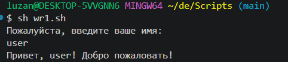
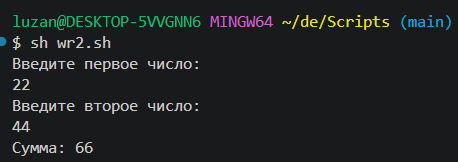
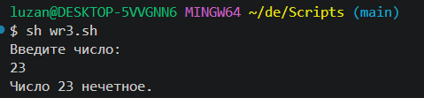
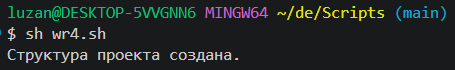
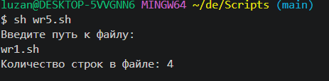
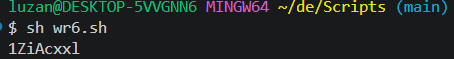
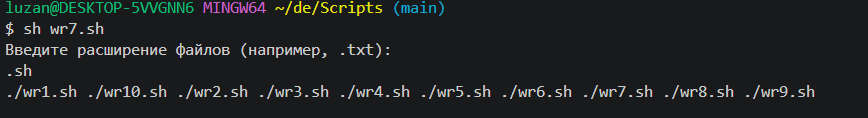

## Bash как язык программирования

`BashScript.md`

* **Скрипты** - это файлы с инструкцией на каком-то ЯП для ОС, которое можно выполнять сразу после их создания без компиляции
* **Программы** - это скомпилированные файлы, которые содержат двоичный код.

```shell
echo "Привет мир!"
```
```
```shell
echo "Текущ. Пользователь: $USER"
```


Файл скрипта на Bash: `script.ah`

```bash
#!/bin/bash
echo "Привет, Мир!"
echo "Сегодня $(date)"
echo "Текущ. Пользователь: $USER"
echo "Как вас зовут?"
read name
echo "Привет, $name! Добро пожаловать в bash-скриптинг"
```

```bash
# fineFile.sh
#!/bin/bash

read -p "Введите имя файла: " filename

if [ -f "$filename" ]; then
    echo "Файл '$filename' существует."
else
    echo "Файл '$filename' не найден (или это не обычный файл)."
fi
```


***

Выполненные задания
1. Напишите скрипт, который спрашивает имя пользователя и выводит приветствие (Напишите скрипт, который спрашивает имя пользователя и выводит приветствие.)
```bash
#!/bin/bash
echo "Как тебя зовут?"
read name
echo "Привет, $name! Добро пожаловать!"
```

2. Калькулятор суммы (Создайте скрипт, который запрашивает два числа и выводит их сумму)
```bash
#!/bin/bash
echo "Введите первое число:"
read num1
echo "Введите второе число:"
read num2
echo "Сумма: $(($num1 + $num2))"
```

3. Проверка четности числа (Напишите скрипт, который определяет, является ли число четным или нечетным)
```bash
#!/bin/bash
echo "Введите число:"
read num
if [ $((num % 2)) -eq 0 ]; then
    echo "Число $num четное."
else
    echo "Число $num нечетное."
fi
```

4. Скрипт - создатель структуры проектов (создайте скрипт, который делает структуру папок для веб-проекта)
```bash
#!/bin/bash
mkdir -p my-project/{css,js}
touch my-project/index.html my-project/css/style.css my-project/js/script.js
echo "Структура проекта создана."
```

5. Счетчик строк в файле (Напишите скрипт, который подсчитывает количество строк в указанном файле)
```bash
#!/bin/bash
echo "Введите путь к файлу:"
read file
if [ -f "$file" ]; then
    echo "Количество строк в файле: $(wc -l < "$file")"
else
    echo "Файл не найден."
fi
```

6. Генератор паролей (Создайте скрипт, который генерирует случайный пароль длиной 8 символов)
```bash
#!/bin/bash
tr -dc 'a-zA-Z0-9' < /dev/urandom | head -c 8
```

7. Поиск файлов (Напишите скрипт, который ищет файлы по расширению в текущей директории)
```bash
#!/bin/bash
echo "Введите расширение файлов (например, .txt):"
read ext
find . -type f -name "*$ext" -print0 | xargs -0 echo
```

