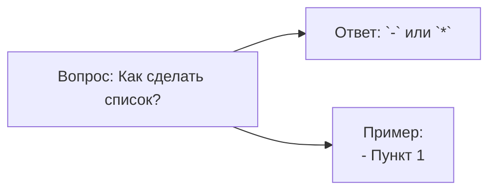
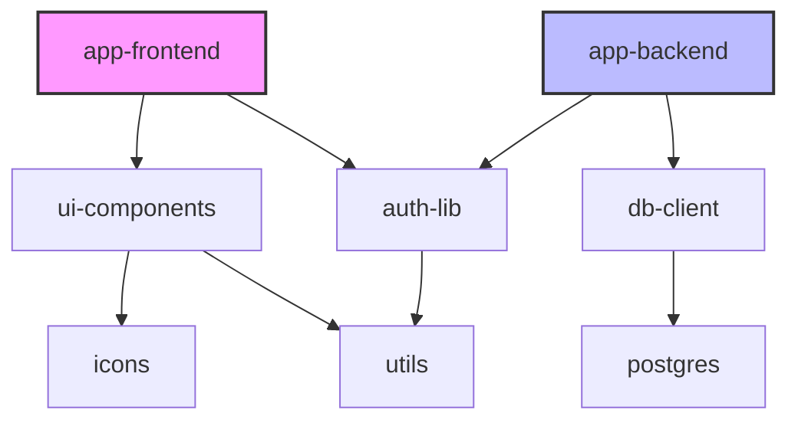
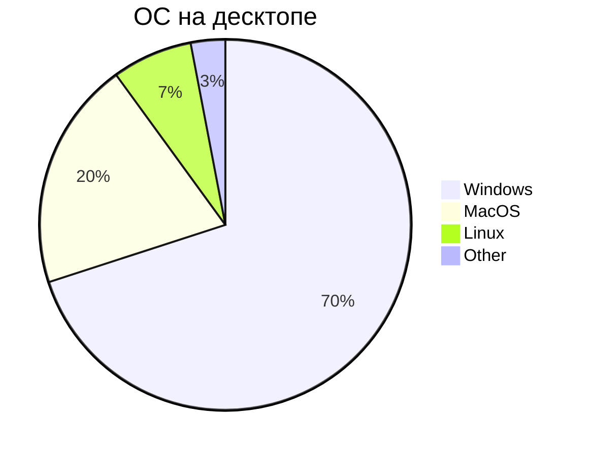

## Mermaid
**Mermaid** - это сильно упрощённый и далёкий аналог **UML** - специальный язык описани блок-схем, графиков и диаграмм с их визуализацией.
> **Самсостоятельно доделать это ридми**
### Блок схемы
#### Базовая структура 1

* `flowchart` - блок-схема
* `LR` - направление вправо
* `A[],B[],C[]` - прямоугольник
* --> - стрелка связи
Виды Mermaid-диаграмм
- Блок-схемы - `graph`, `flowchart`
- Последовательности - `sequenceDiagram`
- Классы - `classDiagram`
- Диаграмма Ганта - `gant`
- Круговые - `pie`
- Состояния
- ER-диаграммы
- Графы зависимостей
#### Базовая структура 2
#### Полный синтаксис блок-схем
### Диаграмма последовательности
sequenceDiagram
participant Пользователь
participant Фронтенд
participant Бэкенд
### Диаграмма класса
classDiagram
Class Class1 {
    attribute name: string
    method void hello()
}
Class Class2 inherits Class1 {
    attribute age: int
}
### Диаграмма Ганта
gantt
    title Проект по разработке сайта

    "Подготовка" -- 2d "Завершение"
    "Дизайн" -- 4d "Дизайн"
    "Разработка" -- 3d "Разработка"
    "Тестирование" -- 2d "Проверка"
### Граф зависимостей

### Диаграмма состояний
stateDiagram-v2
    [*] --> New : Создан
    New --> Paid : Оплата подтверждена
    Paid --> Shipped : Отправлен
    Shipped --> Delivered : Доставлен
    Delivered --> [*]

    New --> Cancelled : Отмена
    Paid --> Cancelled : Возврат
    Cancelled --> [*]

    Shipped --> OnHold : Задержка на таможне
    OnHold --> Shipped : Задержка устранена
    OnHold --> Cancelled : Длительная задержка

    state "New" {
        note right: Ожидание оплаты 24 ч
    }
    state "Shipped" {
        note right: Трекинг активен
    }
### Юзер-джайрни
journey
    title Путь пользователя: подписка (с метриками боли)
    section Регистрация
        Шаг 1: Открыть страницу подписки : 5: me, pain: высокая
        Шаг 2: Ввести email : 3: me, pain: средняя
    section Выбор тарифа
        Шаг 3: Выбрать тариф : 4: me, pain: низкая
        Шаг 4: Подтвердить выбор : 2: me
    section Оплата
        Шаг 5: Ввести данные карты : 5: me, system, pain: высокая
        Шаг 6: Подтвердить платёж : 3: me, system
    section Успех
        Шаг 7: Получить подтверждение : 2: me, pain: нулевая
### Кастомизация стилей
flowchart TD
    A[Начало] --> B{Заказ получен?}
    B -- Да --> C[Проверить наличие]
    B -- Нет --> D[Завершить]
    C --> E{Товар есть?}
    E -- Да --> F[Оформить доставку]
    E -- Нет --> G[Уведомить клиента]
    F --> H[Заказ выполнен]
    G --> H
    H --> I[Конец]
#### Классы CSS
sequenceDiagram
    participant Client
    participant API
    participant DB

    Client->>API: POST /register
    API->>DB: Проверить email
    DB-->>API: Email свободен
    API->>DB: Сохранить пользователя
    DB-->>API: Пользователь создан
    API-->>Client: 201 Created

#### Интерактивность
graph LR
    A[Старт]:::tooltip-start
    B[Обработка]:::tooltip-process
    style A fill:#e1f5fe
    style B fill:#fff3e0
### Круговая диаграмма
